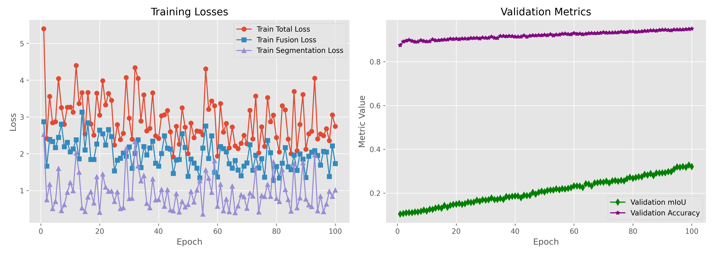
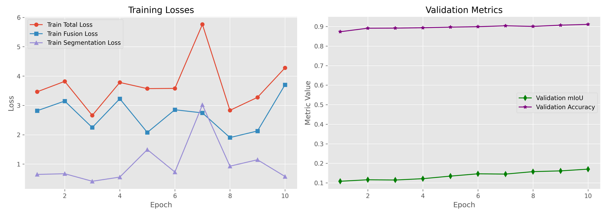
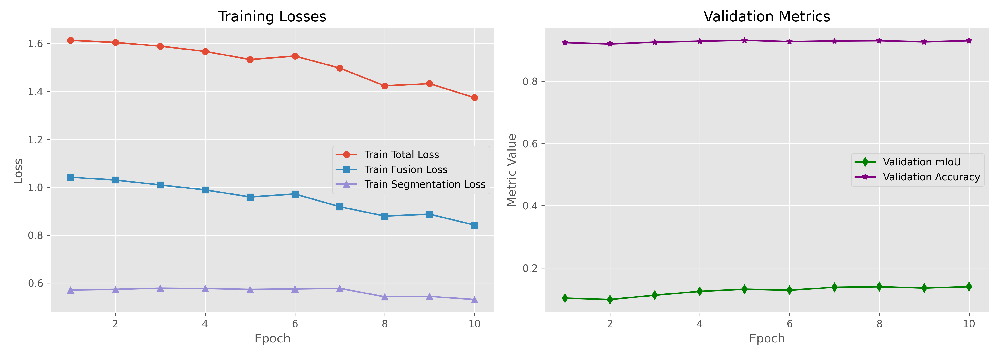

# PSFusion with Jittor
This is a Jittor implementation of [PSFusion](https://github.com/Linfeng-Tang/PSFusion).
If there is anything that can be improved, your suggestions are greatly appreciated.

## Task
We implemented the training process of PSFusion using Jittor. During training, we recorded fusion loss, segmentation loss, mIoU, and accuracy.You can download the trained weights from [checkpoint_epoch_0010](https://pan.baidu.com/s/1Susd8E6nllA1GWkzc14JWQ?pwd=0514).

## Recommended Environment
 - [ ] astunparse 1.6.3
 - [ ] contourpy 1.3.2
 - [ ] cycler 0.12.1
 - [ ] fonttools 4.58.4
 - [ ] jittor 1.3.9.14
 - [ ] kiwisolver 1.4.8
 - [ ] matplotlib 3.10.3
 - [ ] natsort 8.4.0
 - [ ] numpy 1.26.4
 - [ ] opencv-python 4.11.0.86
 - [ ] packaging 25.0
 - [ ] pandas 2.3.0
 - [ ] pillow 11.2.1
 - [ ] pyparsing 3.2.3
 - [ ] python-dateutil 2.9.0.post0
 - [ ] pytz 2025.2
 - [ ] PyYAML 6.0.2
 - [ ] scipy 1.16.0
 - [ ] seaborn 0.13.2
 - [ ] six 1.17.0
 - [ ] tqdm 4.67.1
 - [ ] tzdata 2025.2

## Training 
We sequentially trained the PyTorch for 100 epochs, the PyTorch  for 10 epochs, and the Jittor for 10 epochs.

    

    <em>Pytorch PSFusion training with 100 epochs</em>

    

    <em>Pytorch PSFusion training with 10 epochs</em>

    

    <em>Jittor PSFusion training with 10 epochs</em>

